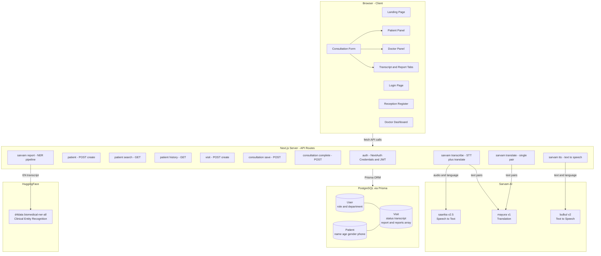
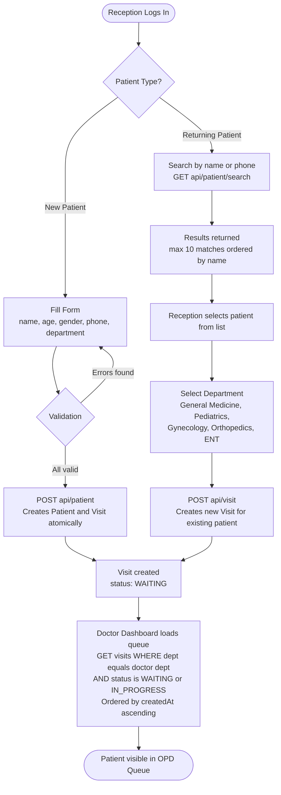
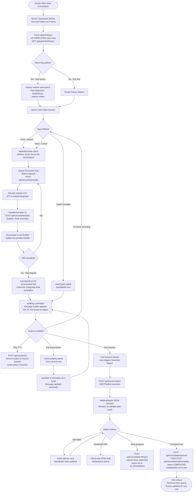
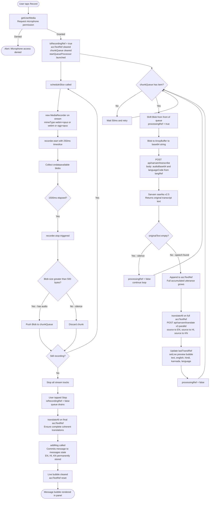
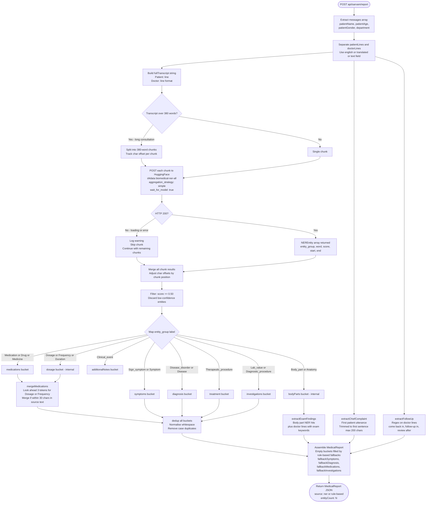
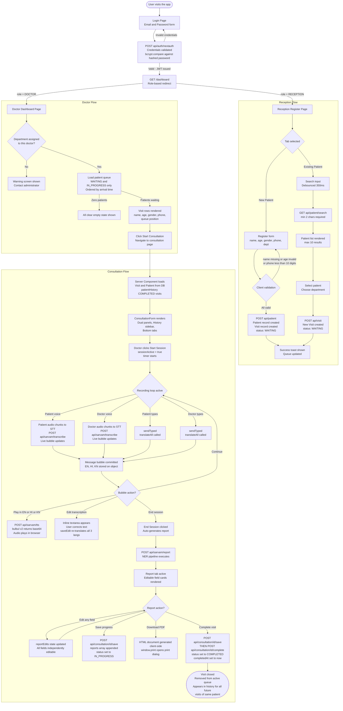
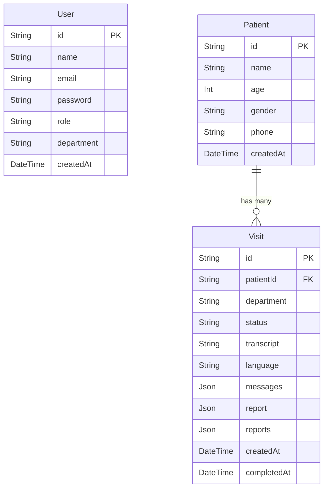

# MediLingua AI

> **AI-powered multilingual OPD consultation platform for Indian hospitals.**
> Transcribes Hindi, Kannada and English simultaneously, generates structured medical reports via biomedical NER, and maintains complete patient visit history — all in under 5 minutes per consultation.
live demo : https://turbo-s-medilingua.vercel.app
---
**eg login : general@hospital.com**
**password : password123**
## Table of Contents

1. [Overview](#overview)
2. [Key Features](#key-features)
3. [Tech Stack](#tech-stack)
4. [System Architecture](#system-architecture)
5. [Patient Registration and Queue Flow](#patient-registration-and-queue-flow)
6. [Consultation Lifecycle](#consultation-lifecycle)
7. [Audio Transcription Pipeline](#audio-transcription-pipeline)
8. [NER Report Generation Pipeline](#ner-report-generation-pipeline)
9. [Role-Based Activity Flow](#role-based-activity-flow)
10. [Project Structure](#project-structure)
11. [API Reference](#api-reference)
12. [Database Schema](#database-schema)
13. [Getting Started](#getting-started)
14. [Environment Variables](#environment-variables)
15. [Deployment](#deployment)
16. [Limitations](#limitations)

---

## Overview

India's OPDs serve patients who speak dozens of regional languages, yet documentation is expected in English. This gap leads to miscommunication, diagnostic errors, and physician burnout from manual note-taking.

**MediLingua AI** bridges this gap by:

- Transcribing patient speech (Kannada / Hindi) and doctor speech (English) in real time using **Sarvam AI `saarika:v2.5`**
- Translating every utterance to all three languages simultaneously so both parties always have full context
- Extracting clinical entities from the transcript using **HuggingFace `d4data/biomedical-ner-all`**
- Generating a fully structured SOAP-style report in under 30 seconds
- Synthesising doctor responses back in the patient's native language via **Sarvam `bulbul:v2`** TTS
- Persisting every visit and report in a versioned history array — never overwritten

---

## Key Features

| Feature | Description |
|---|---|
| Live Multilingual Transcription | Real-time STT for Hindi, Kannada and English simultaneously with live preview bubbles |
| NER-Powered Report Generation | `d4data/biomedical-ner-all` extracts symptoms, diagnosis, medications, and investigations into a SOAP report |
| Text-to-Speech Playback | Per-message EN / HI / KN playback buttons via Sarvam `bulbul:v2` |
| Inline Correction | Edit any mistranscribed bubble — instant re-translation to all 3 languages |
| Patient History Sidebar | All past completed visits with full reports auto-load before the session begins |
| Complete and Export | One-click visit completion plus formatted PDF download |
| Role-Based Access | RECEPTION registers patients; DOCTOR sees only their department's queue |

---

## Tech Stack

| Layer | Technology |
|---|---|
| Framework | Next.js 15 App Router with Server Components |
| Language | TypeScript |
| Auth | NextAuth.js v4 — Credentials provider, JWT strategy |
| Database | PostgreSQL via Prisma ORM |
| STT | Sarvam AI `saarika:v2.5` |
| Translation | Sarvam AI `mayura:v1` |
| TTS | Sarvam AI `bulbul:v2` |
| NER | HuggingFace `d4data/biomedical-ner-all` |
| Password Hashing | bcrypt |
| PDF Export | Client-side HTML via `window.print()` |

---

## System Architecture

The following diagram shows the high-level architecture across the browser, Next.js server, database, and third-party AI services.



---

## Patient Registration and Queue Flow

The following diagram shows how a patient enters the system through Reception and appears in the doctor's OPD queue.



---

## Consultation Lifecycle

The following diagram shows the full lifecycle of a consultation session from the doctor opening the page to visit completion.



---

## Audio Transcription Pipeline

The following diagram shows the detailed audio chunking, queue processing, and translation pipeline inside the Consultation Form.



---

## NER Report Generation Pipeline

The following diagram shows the full report generation pipeline from raw messages to structured MedicalReport JSON.



---

## Role-Based Activity Flow

The following diagram shows the complete activity flow for all user personas across the full patient journey.



---

## Project Structure

```
medilingua-ai/
├── app/
│   ├── page.tsx                              # Public landing page
│   ├── layout.tsx                            # Root layout — Geist fonts, metadata
│   ├── globals.css                           # Tailwind import + CSS variables
│   │
│   ├── login/
│   │   └── page.tsx                          # Login form — NextAuth signIn()
│   │
│   ├── dashboard/
│   │   └── page.tsx                          # Role-based redirect hub (SSR)
│   │
│   ├── doctor/
│   │   └── dashboard/
│   │       └── page.tsx                      # Doctor queue — dept-filtered SSR
│   │
│   ├── reception/
│   │   └── register/
│   │       └── page.tsx                      # New + existing patient registration
│   │
│   ├── consultation/
│   │   └── [visitId]/
│   │       ├── page.tsx                      # Server component: visit + history load
│   │       └── Consultationform.tsx          # Full consultation UI — all logic here
│   │
│   └── api/
│       ├── auth/
│       │   └── [...nextauth]/
│       │       └── route.ts                  # NextAuth credentials + JWT callbacks
│       │
│       ├── patient/
│       │   ├── route.ts                      # POST: create patient + initial visit
│       │   ├── search/
│       │   │   └── route.ts                  # GET: search by name or phone (max 10)
│       │   └── [patientId]/
│       │       └── history/
│       │           └── route.ts              # GET: all COMPLETED visits + reports[]
│       │
│       ├── visit/
│       │   └── route.ts                      # POST: new visit for existing patient
│       │
│       ├── consultation/
│       │   └── [visitId]/
│       │       ├── save/
│       │       │   └── route.ts              # POST: transcript + append to reports[]
│       │       └── complete/
│       │           └── route.ts              # POST: status COMPLETED + completedAt
│       │
│       └── sarvam/
│           ├── transcribe/
│           │   └── route.ts                  # STT via saarika:v2.5 → EN + HI + KN
│           ├── translate/
│           │   └── route.ts                  # Single-pair translation via mayura:v1
│           ├── tts/
│           │   └── route.ts                  # TTS via bulbul:v2 → base64 audio
│           └── report/
│               └── route.ts                  # NER pipeline → MedicalReport JSON
│
├── lib/
│   └── prisma.ts                             # Prisma singleton (dev hot-reload safe)
│
├── prisma/
│   ├── schema.prisma                         # User · Patient · Visit data model
│   └── seed.ts                               # Sample patients + visits seeder
│
├── types/
│   └── next-auth.d.ts                        # Session · User · JWT type augmentation
│
├── next.config.ts
├── next-env.d.ts
└── package.json
```

---

## API Reference

### Authentication

| Method | Endpoint | Description |
|---|---|---|
| POST | `/api/auth/[...nextauth]` | Credential login — issues JWT session cookie |
| GET | `/api/auth/[...nextauth]` | Session fetch and OAuth callback handler |

### Patient Management

| Method | Endpoint | Body / Params | Description |
|---|---|---|---|
| POST | `/api/patient` | `{ name, age, gender, phone, department }` | Create patient + initial visit atomically |
| GET | `/api/patient/search?q=` | `q` — min 2 characters | Search patients by name or phone — max 10 results |
| GET | `/api/patient/[patientId]/history` | — | All COMPLETED visits with full `reports[]` array |

### Visit Management

| Method | Endpoint | Body | Description |
|---|---|---|---|
| POST | `/api/visit` | `{ patientId, department }` | Create new visit for an existing patient |

### Consultation

| Method | Endpoint | Body | Description |
|---|---|---|---|
| POST | `/api/consultation/[visitId]/save` | `{ messages, report, language }` | Save transcript and append report to `reports[]` |
| POST | `/api/consultation/[visitId]/complete` | — | Set `status: COMPLETED` and set `completedAt` |

### Sarvam AI Integrations

| Method | Endpoint | Body | Response |
|---|---|---|---|
| POST | `/api/sarvam/transcribe` | `{ audioBase64, languageCode }` | `{ original, hindi, english, kannada, languageCode }` |
| POST | `/api/sarvam/translate` | `{ text, sourceLanguage, targetLanguage }` | `{ translatedText }` |
| POST | `/api/sarvam/tts` | `{ text, targetLanguage }` | `{ audioBase64, targetLanguage }` |
| POST | `/api/sarvam/report` | `{ messages, patientName, patientAge, patientGender, department }` | `{ report: MedicalReport, source, entityCount }` |

### MedicalReport JSON Schema

```typescript
interface MedicalReport {
  chiefComplaint:           string     // First patient utterance, max 200 chars
  historyOfPresentIllness:  string     // All patient lines joined, max 600 chars
  symptoms:                 string[]   // NER Sign_symptom entities
  examFindings:             string     // Body_part NER + doctor exam-keyword lines
  diagnosis:                string     // NER Disease_disorder entities joined by semicolon
  treatment:                string[]   // NER Therapeutic_procedure entities
  medications:              string[]   // NER Medication + merged Dosage/Frequency tokens
  investigations:           string[]   // NER Lab_value + Diagnostic_procedure entities
  followUp:                 string     // Regex extraction from doctor lines
  additionalNotes:          string     // NER Clinical_event + dept/patient summary
}
```

---

## Database Schema



**Enums:**

| Enum | Values |
|---|---|
| `Role` | `RECEPTION` · `DOCTOR` |
| `Department` | `GENERAL_MEDICINE` · `PEDIATRICS` · `GYNECOLOGY` · `ORTHOPEDICS` · `ENT` |
| `Status` | `WAITING` · `IN_PROGRESS` · `COMPLETED` |

---

